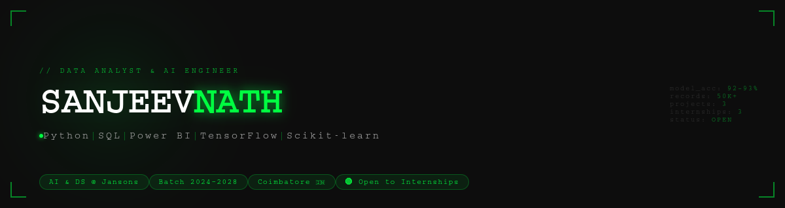

<div align="center">


<br/>

[](mailto:sanjeevnath710@gmail.com)
[](https://www.linkedin.com/in/sanjeevnath-c-p)
[](https://github.com/SANJEEVNATHCP)


</div>

---

### `> whoami`

```python
sanjeevnath = {
    "name"      : "Sanjeevnath C P",
    "role"      : "Data Analyst & AI/ML Engineer",
    "degree"    : "B.Tech AI & Data Science",
    "college"   : "Jansons Institute of Technology",
    "batch"     : "2024 → 2028",
    "cgpa"      : 8.13,
    "location"  : "Coimbatore, Tamil Nadu 🇮🇳",
    "status"    : "Open to Remote Internships 🟢",
    "superpower": "Turning messy data into clean decisions",
}
```

---

### `> tech_stack`

<div align="center">


</div>

---

### `> projects`

<table>
<tr>
<td width="33%" align="center">

**🧾 [TAXCALM](https://github.com/SANJEEVNATHCP/Taxcalm---AI-Powered-MSME-Assistance)**

AI-Powered MSME Assistance

Risk monitoring & prediction for small businesses. **90% accuracy**, reduced losses by **25%**.

`Python` `Pandas` `Scikit-learn`

</td>
<td width="33%" align="center">

**🌿 [CropYield-AI](https://github.com/SANJEEVNATHCP/cropai)**

Disease & Price Prediction

AI crop health monitoring system. **93% accuracy**, improved productivity & cut losses by **30%**.

`Python` `TensorFlow` `Scikit-learn`

</td>
<td width="33%" align="center">

**🌐 [AI-Translator](https://github.com/SANJEEVNATHCP/ai-translator)**

Intelligent Language Translation

AI-powered multi-language translation using cutting-edge NLP techniques.

`Python` `NLP` `AI`

</td>
</tr>
</table>

---

### `> github_stats`

<div align="center">


<br/><br/>


</div>

---

### `> achievements`

<div align="center">

| 🏅 | Competition | College | Result |
|:---:|:---|:---|:---:|
| 🥇 | EMICA Promptify | Tamilnadu College | **1st Place** |
| 🥇 | Zenith Introdux-45 | KGISL College | **1st Place** |
| 🥈 | Omni-Tech Data Spectrum | Suguna College | **2nd Place** |
| 🥉 | Udhayam '26 Project Expo | KIT College | **3rd Place** |

</div>

---

### `> experience`

```
╔══════════════════════════════════════════════════════════════════════════════════╗
║  📍 Data Analytics Intern  @ Appin Technology       [Jun–Jul 2025]             ║
║     → Analyzed 50K+ records · +40% efficiency · Power BI dashboards            ║
╠══════════════════════════════════════════════════════════════════════════════════╣
║  📍 AI & ML Virtual Intern @ Infosys Springboard    [Aug–Oct 2025]             ║
║     → 92% model accuracy · -30% manual effort · hyperparameter tuning          ║
╠══════════════════════════════════════════════════════════════════════════════════╣
║  📍 Data Analytics Intern  @ Tamizhan Skills RISE   [Mar 2026]                 ║
║     → Churn prediction · financial risk analysis · EDA & feature engineering   ║
╚══════════════════════════════════════════════════════════════════════════════════╝
```

---

### `> trophies`

<div align="center">

[](https://github.com/ryo-ma/github-profile-trophy)

</div>

---

<div align="center">

```
╔══════════════════════════════════════════════════════════════╗
║   "Turning raw data into decisions that matter."             ║
║                                      — Sanjeevnath C P      ║
╚══════════════════════════════════════════════════════════════╝
```


</div>
